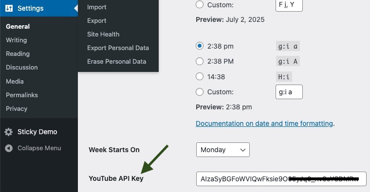

# BWL YouTube Video Schema Injector

Injects schema markup for YouTube videos in WordPress posts, pages, and custom post types.

## Requirements

- WordPress 6.0 or higher
- PHP 8.2 or higher
- Composer for dependency management
- Basic knowledge of WordPress plugin development
- YouTube API Key.

## How to Use

1. **Install the Plugin**: Download and install the BWL YouTube Video Schema Injector plugin from the WordPress plugin repository or upload it manually.
2. **Activate the Plugin**: Go to the Plugins section in your WordPress admin dashboard and activate the BWL YouTube Video Schema Injector plugin.
3. **Configure the Plugin**: Navigate to the plugin settings page to enter your YouTube API key and configure any additional settings as needed.
   
4. **Add YouTube Video URLs**: In your posts, pages, or custom post types, add YouTube video URLs in the content editor. The plugin will automatically detect these URLs and inject the appropriate schema markup.
5. **Check Schema Markup**: Use tools like Google's Structured Data Testing Tool to verify that the schema markup has been correctly injected into your content.

## Changelog

### 1.0.0

- Initial release of the plugin.
